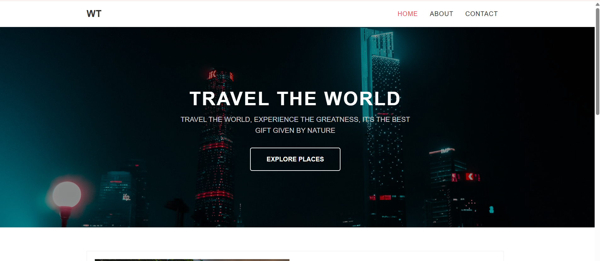
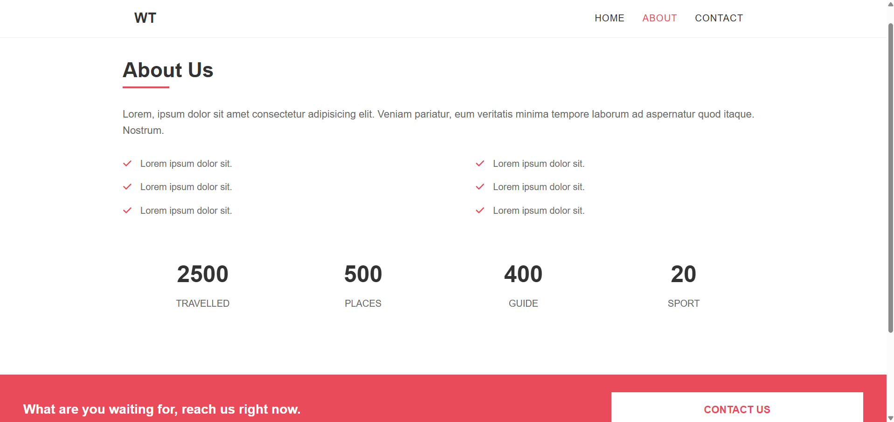
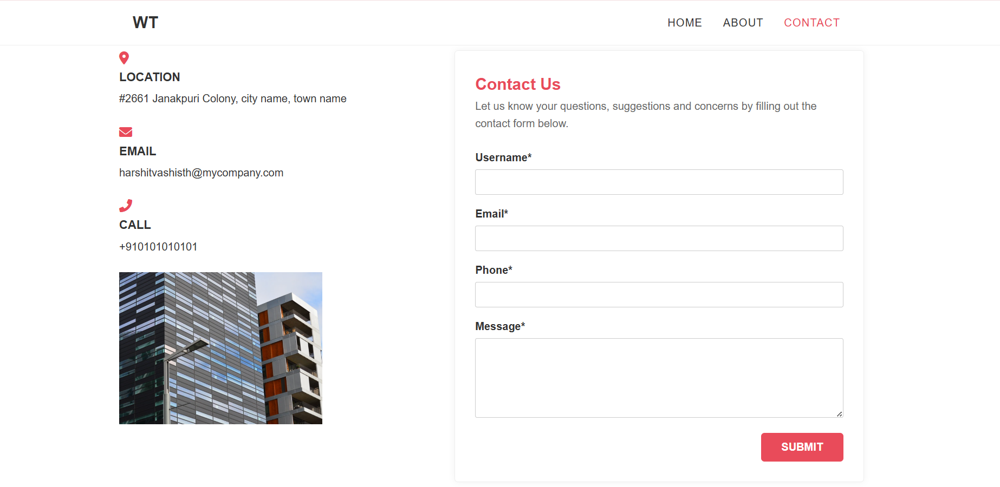

# Travel-Agency-Website 🌍

A responsive travel agency website built using HTML and CSS featuring modern layouts, travel showcases, and multiple webpages.

## Features
- Responsive travel website design
- Home, About, and Contact pages
- Beautiful travel destination showcases
- Modern and clean UI
- Organized webpage structure

## Technologies Used
- HTML5
- CSS3

## Project Structure

```bash
├── index.html
├── about.html
├── contact.html
├── style.css
├── images
```

## Future Improvements
- Add JavaScript functionality
- Improve responsiveness
- Add booking functionality
- Add animations and transitions

## Author
Fiza Qamar

## Screenshots

### Homepage


### About Page


### Contact Page

